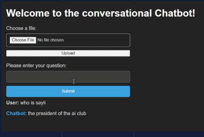
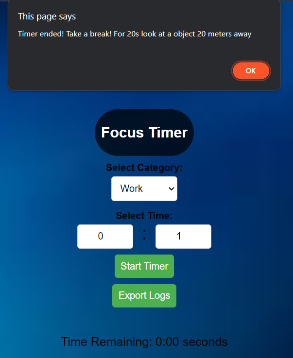
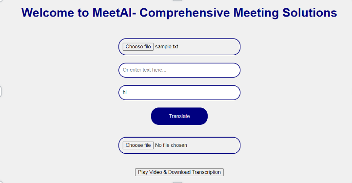

# Ai.Works

Introducing AI.works, the ultimate remote work companion. A platform for efficient productivity tracking, multilingual meeting assistance, and engaging in insightful content discussions with our intelligent chatbot – your all-in-one solution for efficient digital collaboration.


## Features

 AI.works redefines remote collaboration through three core pillars:
- The Remote Wellness Hub prioritizes work-life balance with real-time tracking and thoughtful reminders. 
- Meet.ai serves as an intelligent meeting assistant, transcribing discussions and breaking language barriers. 
- Work Assist.ai integrates a smart chatbot for seamless content interaction.

## Deployment

To deploy this project run

First clone the repo

Then install the following libraries
```python
Python(pip install)
 -langchain
- huggingface_hub
- sentence_transformers
- flask
- gtts
- googletrans
- whisper
```
You also require API keys for the following
- huggingface
- Fitbit

After install all the dependencies 
```bash
- open cmd and run
- python app.py
- python app1.py
Then open the main html page and you can acess all the 3 cycle through all the function of the website.
```

## Authors

- [@codekid211](https://github.com/codekid211)
- [@SayliJain](https://github.com/SayliJain)
- [@RatanRavichandran](https://github.com/RatanRavichandran)
- [@SakshiA23](https://github.com/SakshiA23)

## Screenshots
- This the main page


- This the inteface Workassist.ai



- This a focus timer 



- This is the Meet.ai inteface



- This is the result interface
 


## Acknowledgements

 - (@Prompt Engineering)(https://www.youtube.com/@engineerprompt)
he has very informative videos on development of models using agents


